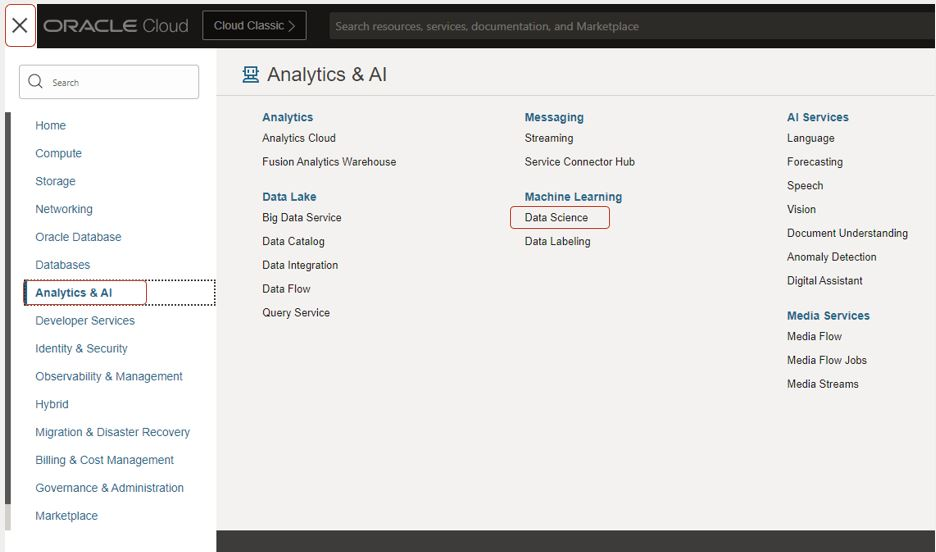
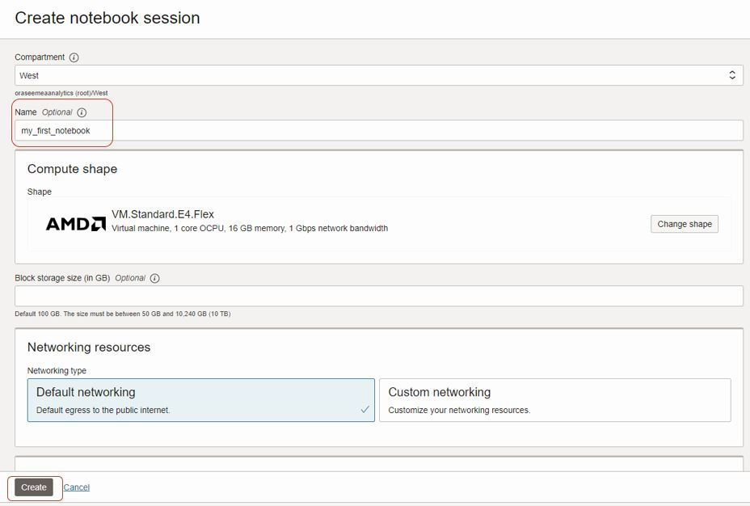
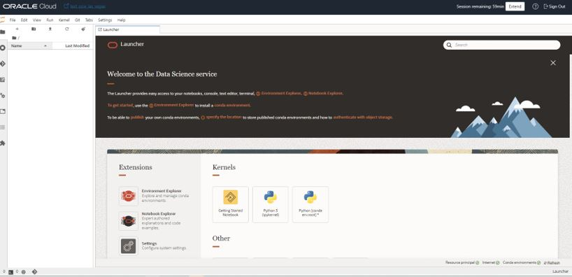
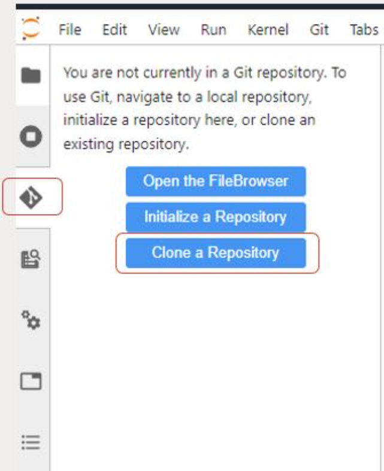
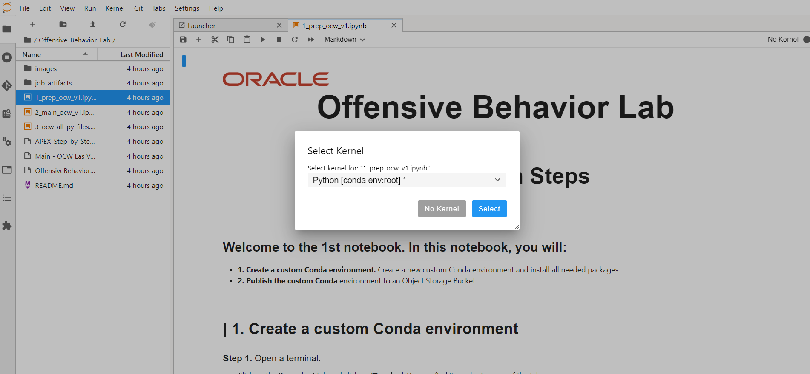

# Deploy in a Reranker model using OCI Data Science, Model Deployment

## Task 1: Create a Notebook session

1. In Oracle Cloud, click on the hamburger menu, and following on Analytics & AI
2. Click on **Data Science**
3. Select the correct compartment on the left
4. Select **Create Project**. You can name the Project to your own liking
5. Click on **Create**. This will create a project.
6. Step inside the project
  
  

7.	Click **Create Notebook**
8.	You can use all default settings
9.	Optional: change the shape of the notebook session by clicking on **Change Shape**
10.	Use **Default Networking**
11.	Leave Block storage size empty
12.	Click on **Create**
13.	This may take a few minutes, when the notebook is **Active**, click on the name of the notebook to access the main page
  

14.	Click on **Open** to open the notebook
15.	When you are prompted to log in, log in with your Oracle Cloud credentials
16.	The page as shown in the screenshot below should appear
  

## Task 2: Clone Repository and run notebook

1. Click on the **Git** tab on the left
2. Click on **Clone a Repository**
3. Add https://github.com/bobpeulen/deploy_reranker.git
4. Click **Clone**. A new, **deploy\_raranker** repository should appear in the directory on the left
5. Step inside the new folder
6. Open the notebook: **deploy\_rerank\_model.ipynb**
7. When prompted for **Select Kernel**, just click on **Select**
8. Follow the steps in the notebook closely.
   
  
  

## Acknowledgements
* [Bob Peulen](https://www.linkedin.com/in/bobpeulen/)
* **Last Updated By/Date** - Bob Peulen, May 2024
